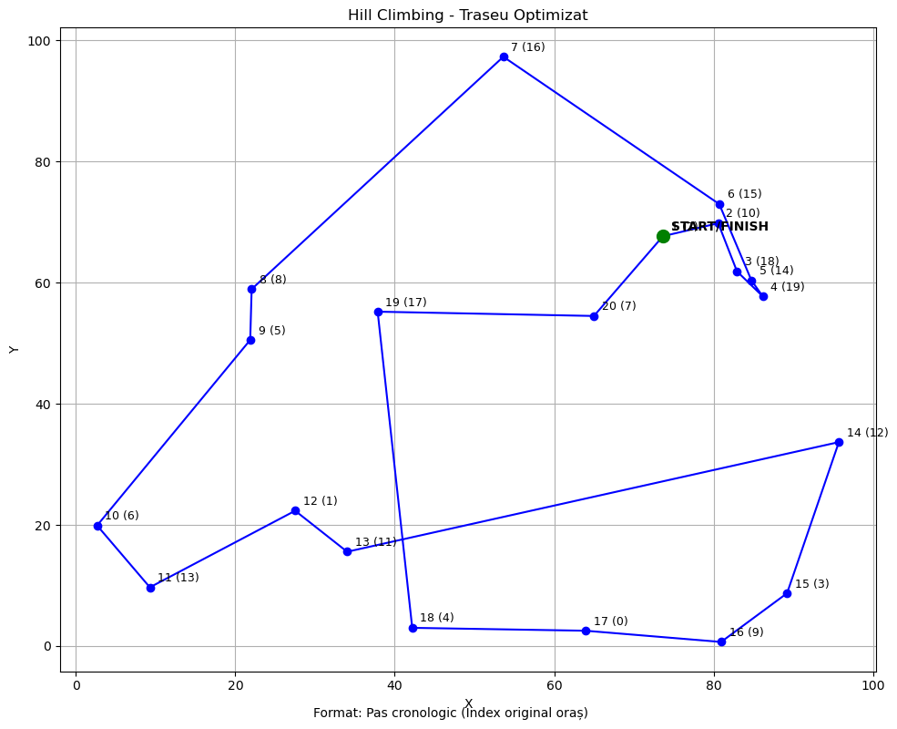
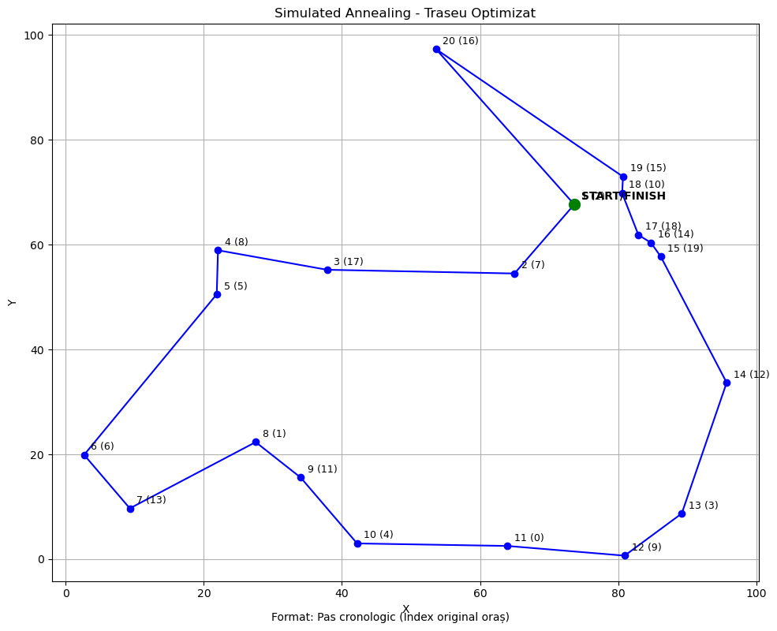
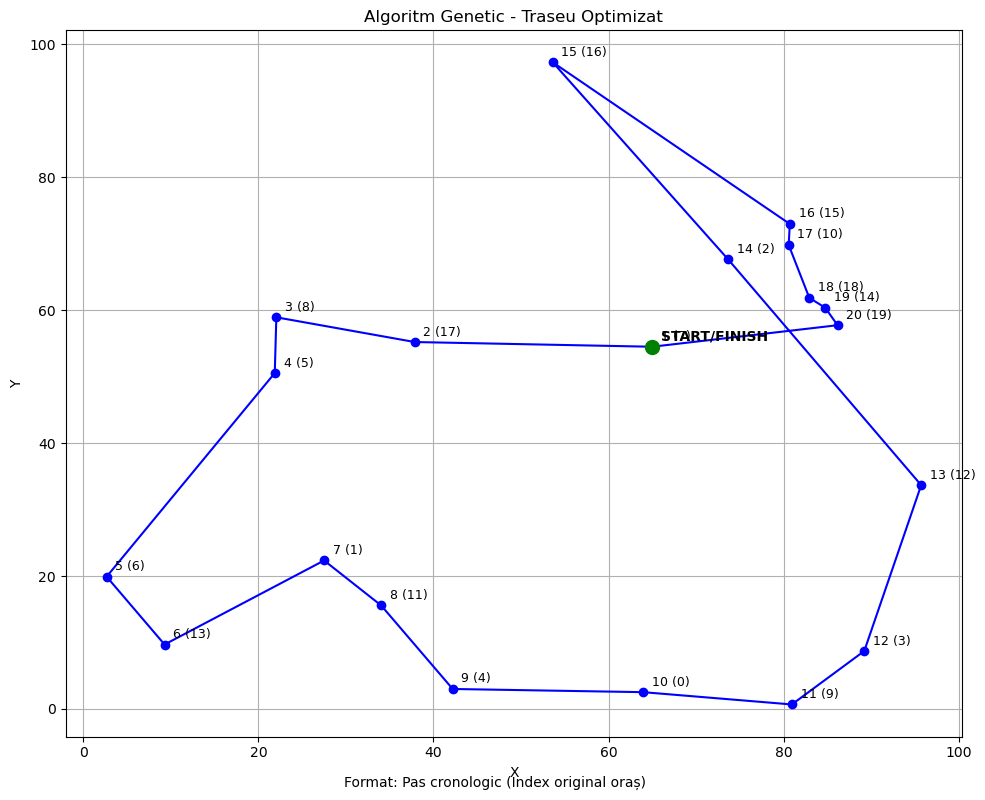

# 🧭 AI Optimization – Solving the Traveling Salesman Problem (TSP)

## 📖 Project Overview
This project addresses the **Traveling Salesman Problem (TSP)**, where an agent must visit a set of cities exactly once and return to the starting point while minimizing the total travel distance.  

The application implements and compares three AI algorithms:
- **Hill Climbing**
- **Simulated Annealing**
- **Genetic Algorithm**

The results are visualized using a graphical interface that displays how each algorithm optimizes the route.

---

## 🛠️ Technologies Used
- **Python** – main programming language  
- **Matplotlib** – graphical route visualization  
- **Random & Math** – city generation and distance calculation  
- **AI Algorithms** – Hill Climbing, Simulated Annealing, Genetic Algorithm  

---

## 🔍 Algorithm Implementation

| Algorithm            | Description                                                                 | Pros                                           | Cons                                   |
|----------------------|----------------------------------------------------------------------------|-----------------------------------------------|----------------------------------------|
| **Hill Climbing**    | Iteratively improves the route by swapping cities and keeping better solutions. | ✅ Fast, simple to implement                  | ❌ Easily stuck in local minima        |
| **Simulated Annealing** | Starts like Hill Climbing but accepts worse solutions with a probability that decreases over time. | ✅ Escapes local minima                        | ❌ Sensitive to parameter tuning       |
| **Genetic Algorithm**| Uses population evolution (selection, crossover, mutation) to generate better solutions. | ✅ Finds high-quality solutions for complex problems | ❌ Higher execution time             |

---

| Hill Climbing | Simulated Annealing | Genetic Algorithm |
|---------------|---------------------|-------------------|
|  |  |  |

---

## 🧩 Implementation Details
- **`generate_cities(n)`** → generates `n` cities with random coordinates.  
- **`total_distance(route, cities)`** → calculates the total cost of a route.  
- **`plot_route(route, cities)`** → visualizes the route on a 2D map.  
- The script compares the algorithms and displays both the cost and the route visually.

---

## 🧠 What I Learned
- How to implement and compare multiple **AI optimization algorithms**.  
- Understanding **local minima** and how algorithms avoid them (SA & GA).  
- How **selection, crossover, and mutation** evolve better solutions.  
- Integrating **visualization** into optimization problems.

---

## 🚀 How to Run

1. Clone the repository:
 ```bash
   git clone https://github.com/username/AI-TSP-Optimization.git
   ```
2. Install required dependencies:
  ```bash
  pip install matplotlib
```
3. Run the script:
  ```bash
  python proiect3_AI.py
```
4. Check the terminal for route costs and watch the route visualization in the generated plots.
   
---

## 👩‍💻 Author
Created by **Andra Bogde**  
🎓 *Undergraduate Student at the Faculty of Mathematics and Computer Science, Ovidius University*  
🌱 *Currently pursuing a Master's in Cybersecurity & Machine Learning*

---

<div align="center">
  <sub>💖 Proudly sharing my work and continuous learning journey</sub>
</div>

